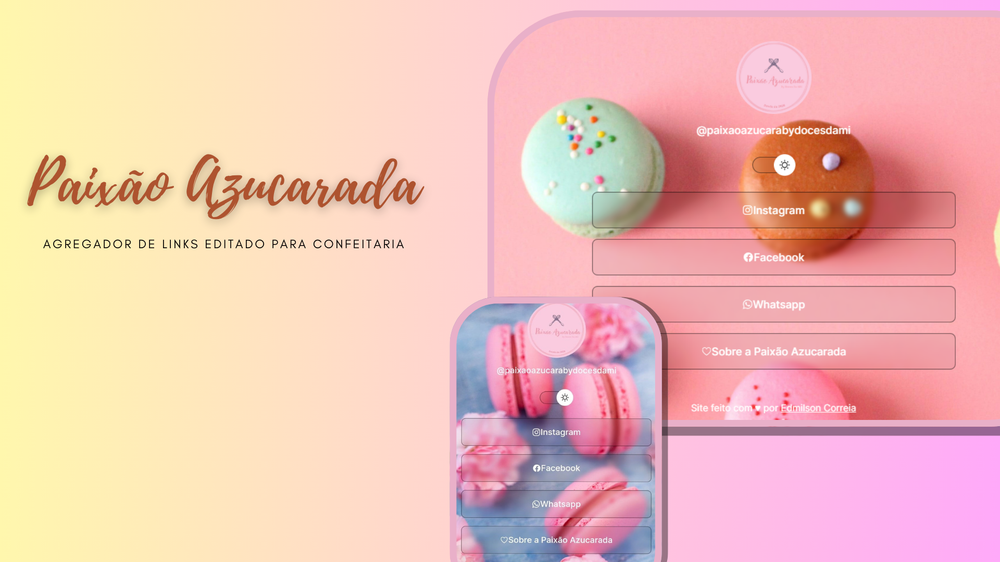

<h1 align="center"> Paixão Azucarada </h1>

 Sabores que transformam momentos ♥

  <a href="#-tecnologias">Tecnologias</a>&nbsp;&nbsp;&nbsp;|&nbsp;&nbsp;&nbsp;
  <a href="#-projeto">Projeto</a>

 

  

## 🚀 Tecnologias

Esse projeto foi desenvolvido com as seguintes tecnologias:

- HTML e CSS
- JavaScript
- Git e Github

## 💻 Projeto

Agregador de Links de Confeitaria 
   
Este site foi feito como um projeto Desafio do curso Discovery da RocketSeat

Baseado no Projeto Discovery da <a href="https://www.rocketseat.com.br/">rocketseat</a>
